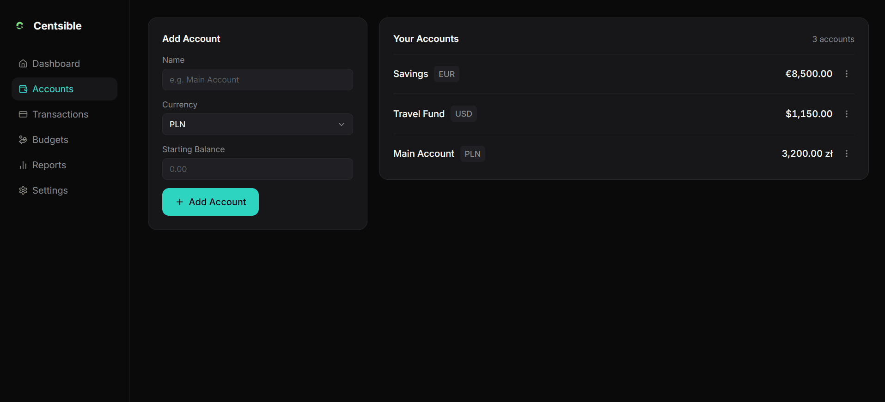
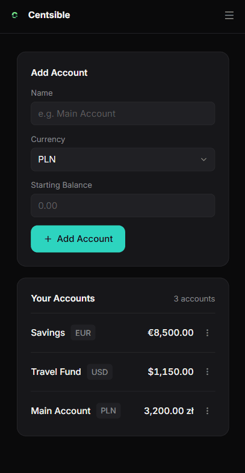

# Centsible

Budget tracker and planner with AI-powered analytics. Work in progress.

**[Live demo](https://centsible-budget.vercel.app/)** · [API repository](https://github.com/volha-codes/centsible-api)

 

## Status

The Accounts tab is built end to end: add, edit and delete accounts, duplicate-name
validation, currency formatting, loading, error and empty states, responsive layout.
Data is stored in PostgreSQL through the API, so it survives a page refresh.

Not built yet: Categories, Transactions, Budgets, Reports, AI insights, authentication.

The demo has no login, so everything in it is shared. Please don't enter real data.
The API runs on a free Render instance, so the first request after a pause can take
up to a minute while it wakes up.

## Stack

React · TypeScript · Redux Toolkit · Tailwind CSS v4 · Vite

Tested with Vitest + React Testing Library. The backend lives in a separate repository:
NestJS · Prisma · PostgreSQL (Neon).

## Getting started

```bash
npm install
npm run dev
```

The app talks to the API at `http://localhost:3000` by default. To use another
backend, create a `.env.local` file:

```
VITE_API_URL=https://your-api.example.com
```

## Testing

```bash
npm run test        # watch mode
npm run test:run    # single run
```

Reducers are tested through the thunk lifecycle actions, and the Accounts screen is
tested with a mocked `fetch`: loading, error with retry, empty state, creating an
account and a double click sending a single request.

## Roadmap

- [x] Backend + persistence (NestJS, Prisma, PostgreSQL)
- [ ] Categories and Transactions
- [ ] Authentication
- [ ] Budgets and Reports
- [ ] AI-powered insights
- [ ] React Native mobile app, sharing types and Redux slices with the web app
